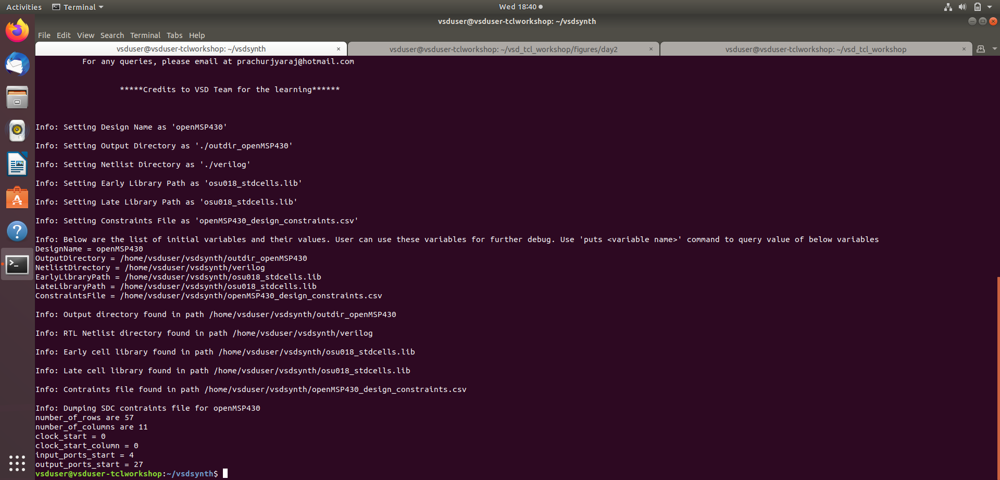

# Lab Sessions 

# Day 1: Introduction to TCL and VSDSYNTH Toolbox
	1. Input Design file in csv format (openMSP430\_design\_details.csv)
 
	2. Yoysys tool installed
 
	3. vsdsynth working directory from vdi.
 
	4. Opentimer Tool installed
 
 
## VSD TOOLBOX
	1. Create a shellscript vsdsynth as a command
  
	2. Create variables from input csv file into tcl script
  
	3. Run ./vsdsynth in command line.
  
	4. Script Check if the created variables path ,files, directories exist or not.
  
	5. Run the script to verify 
  
	6. Script for - If the input file (csv) is incorrect or not provided 
  
	7. Run the script & verify. 
  

# DAY 2: VARIABLE CREATION AND PROCESSING CONSTRAINTS FROM CSV 
  
  
  
  

### Demo for computing row numbers 
  
  
  

 # DAY 3: PROCESSING CLOCK AND INPUT CONSTRAINTS 
  
  
  
  
  
  
  
  
  
  
  
  

 

  
